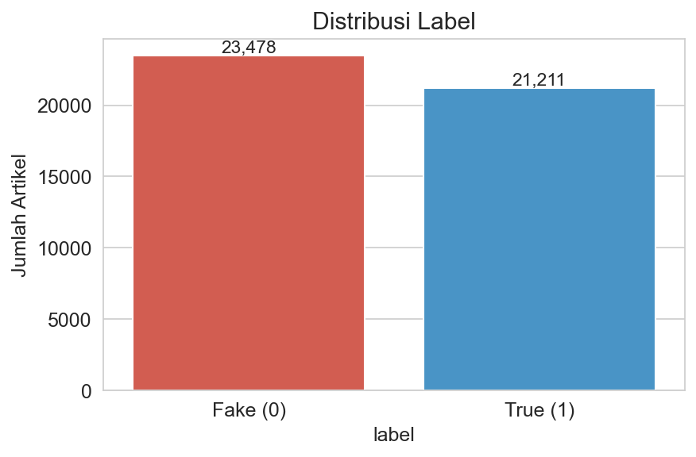
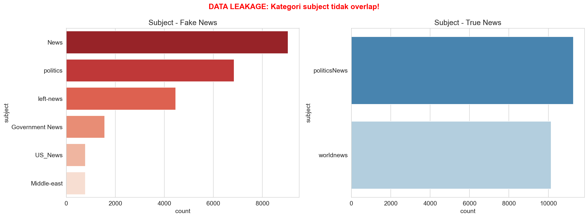
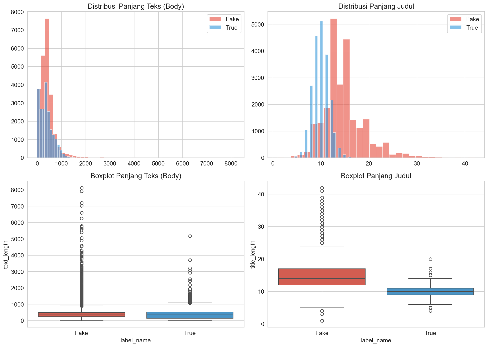
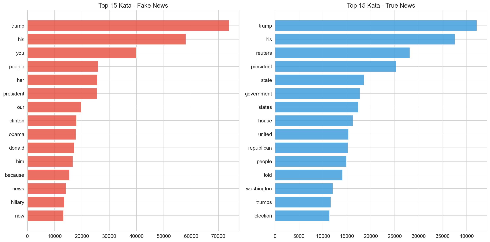
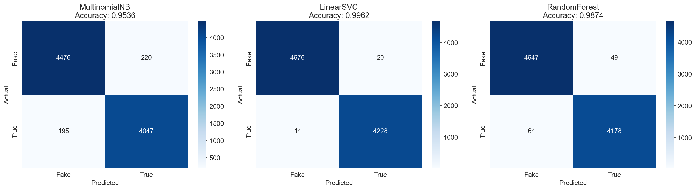
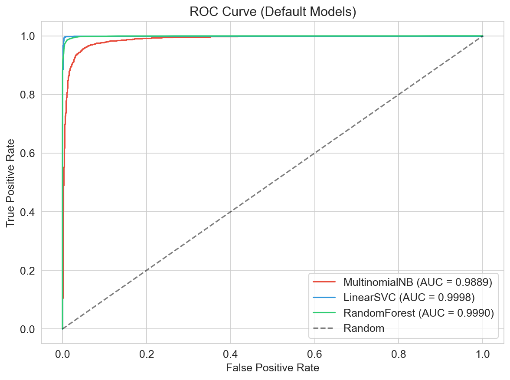
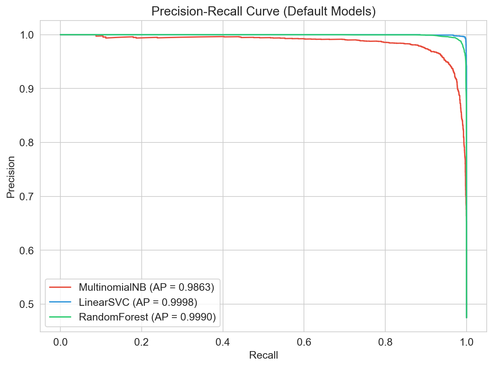
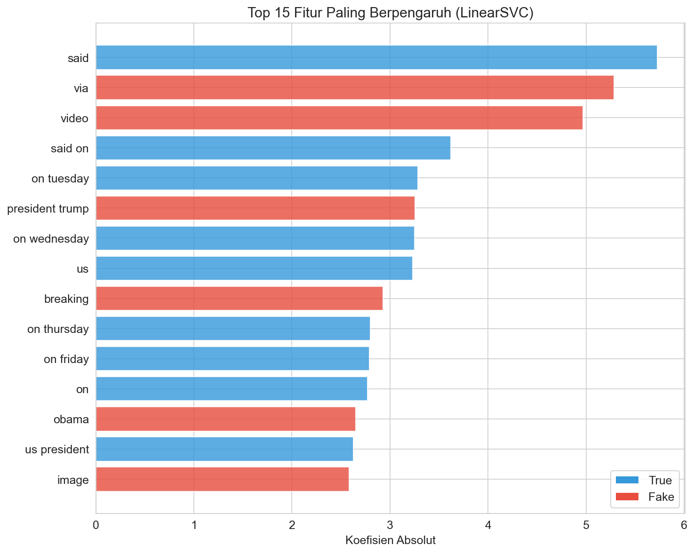

# Fake News Detection

<div align="center">


**Classifying fake vs real news articles using MultinomialNB, LinearSVC, and RandomForest with TF-IDF features**

[Key Findings](#-key-findings) • [Dataset](#-dataset) • [Notebooks](#-notebooks) • [Results](#-model-performance) • [Usage](#-installation--usage)

</div>

---

## About The Project

Fake news on social media and news platforms is a growing threat to public trust. Automatically detecting fabricated articles helps platforms, readers, and fact-checkers identify unreliable content before it spreads.

This project uses **supervised text classification** to distinguish fake news from real news using the ISOT Fake News Detection Dataset. Three models are compared: **MultinomialNB**, **LinearSVC**, and **RandomForest**, with hyperparameter tuning via GridSearchCV.

The key finding is that **LinearSVC achieves the best performance (99.62% accuracy)**, demonstrating that linear models with TF-IDF features are highly effective for fake news detection.

### Objectives

1. Explore patterns and characteristics of fake vs real news articles
2. Identify and remove data leakage (subject column, Reuters attribution patterns)
3. Compare multiple classification models on text data
4. Evaluate with robust metrics (Accuracy, F1, AUC-ROC, MCC)

---

## Key Findings

### Can we predict fake news?

**YES!** LinearSVC achieves strong performance:

| Metric | LinearSVC | MultinomialNB | RandomForest |
|--------|:---------:|:-------------:|:------------:|
| **Test Accuracy** | **0.9962** | 0.9536 | 0.9874 |
| **F1-Score (macro)** | **0.9962** | 0.9535 | 0.9873 |
| **AUC-ROC** | **0.9998** | 0.9889 | 0.9990 |

- **Accuracy = 99.62%**, correctly classifies nearly all articles
- **F1-Score macro = 0.9962**, balanced performance across both classes
- **No overfitting**, train-test gap < 0.5% for all models

### What drives predictions?

Top factors influencing classification:

1. **"said"**, strong indicator of real news (formal journalism style)
2. **"via", "video", "watch"**, strong indicators of fake news (sensationalist language)
3. **"reuters"**, appeared as a leakage feature before preprocessing fix
4. **Bigram patterns**, "of the", "in the" indicate real news writing style

### Data Leakage Identified and Fixed

Two critical leakage sources were found and addressed:

1. **Subject column**, zero overlap between fake/real categories, dropped entirely
2. **Reuters attribution patterns**, "WASHINGTON (Reuters) -", "told Reuters", "Reuters/Ipsos" appeared in 23% of real news but only 1.4% of fake news. Comprehensive regex removed all attribution patterns.
3. **TF-IDF fit leakage**, TF-IDF was fit on full dataset before split. Fixed by splitting data first, then fitting TF-IDF on training data only.

---

## Dataset

**Source**: [Fake and Real News Dataset](https://www.kaggle.com/datasets/clmentbisaillon/fake-and-real-news-dataset) by Clément Bisaillon

**Description**: Two datasets, one containing real news articles from Reuters and one containing fake news articles from various unreliable sources.

**Statistics**:

| Property | Value |
|----------|-------|
| Samples | 44,689 articles |
| Features | title, text, subject, date |
| Target | `label` (0 = Fake, 1 = Real) |
| Fake articles | 23,478 (52.5%) |
| Real articles | 21,211 (47.5%) |

**Balanced dataset**, both classes have similar representation.

**Known Issues Addressed**:
- `subject` column has zero overlap between classes (data leakage), **dropped**
- 630 Fake articles have empty text (title only), **combined title + text**
- Reuters attribution patterns create shortcut for model, **removed via regex**

**Class Distribution**:

| Label | Count | Percentage |
|-------|-------|------------|
| Fake (0) | 23,478 | 52.5% |
| Real (1) | 21,211 | 47.5% |

→ **Balanced dataset** — both classes have similar representation.

**Features**:

| # | Feature | Description |
|---|---------|-------------|
| 1 | title | Article headline |
| 2 | text | Full article body |
| 3 | subject | News category (dropped due to leakage) |
| 4 | date | Publication date |
| 5 | label | Target: 0 = Fake, 1 = Real |

---

## Project Structure

```
Fake News Detection/
├── data/
│   ├── raw/                              # Raw dataset
│   │   ├── Fake.csv                      # 23,481 fake articles
│   │   └── True.csv                      # 21,417 real articles
│   └── processed/                        # Processed data
│       ├── cleaned_data.csv              # Cleaned text + labels
│       ├── X_train_tfidf.npz             # TF-IDF training matrix
│       ├── X_test_tfidf.npz              # TF-IDF testing matrix
│       ├── y_train.npy                   # Training labels
│       └── y_test.npy                    # Testing labels
├── notebooks/                            # Jupyter notebooks (numbered)
│   ├── 01_eda.ipynb                      # Exploratory Data Analysis
│   ├── 02_preprocessing.ipynb            # Text Preprocessing
│   ├── 03_feature_extraction.ipynb       # TF-IDF Feature Extraction
│   └── 04_modeling.ipynb                 # Modeling & Evaluation
├── models/                               # Trained models
│   ├── model_best.pkl                    # Best model (LinearSVC)
│   └── tfidf_vectorizer.pkl              # TF-IDF vectorizer
├── images/                               # Exported visualizations
│   ├── 01_label_distribution.png
│   ├── 02_subject_leakage.png
│   ├── 03_text_length_distribution.png
│   ├── 04_top_words.png
│   ├── 05_confusion_matrix_default.png
│   ├── 06_roc_curve_default.png
│   ├── 07_precision_recall_default.png
│   ├── 08_feature_importance_default.png
│   └── 09_feature_importance_best.png
├── docs/
│   └── RUNNING_GUIDE.md                  # Panduan menjalankan project
├── streamlit/                            # Streamlit demo app
│   ├── app.py                            # Main application
│   ├── requirements.txt                  # App dependencies
│   └── .streamlit/
│       └── config.toml                   # Dark theme config
├── requirements.txt                      # Project dependencies
├── README.md                             # This file
└── .gitignore
```

---

## Notebooks

### 1. Exploratory Data Analysis (`01_eda.ipynb`)
- Label distribution analysis (fake vs real)
- Data leakage identification: subject column overlap
- Reuters attribution pattern analysis
- Text length distribution by class
- Top words per class






**Key Insights**:
- Dataset is balanced (52.5% fake, 47.5% real)
- Subject column has zero overlap between classes, critical leakage
- "said" is the strongest indicator of real news
- Real news articles are shorter on average (Reuters style)

### 2. Text Preprocessing (`02_preprocessing.ipynb`)
- **Drop subject column**, data leakage removal
- **Combine title + text**, handle 630 empty text articles
- **Remove Reuters attribution patterns**, comprehensive regex (30+ patterns)
- **Lowercase**, normalize text
- **URL/email removal**, remove web references
- **Punctuation & number removal**, clean text
- **Unicode cleanup**, remove replacement characters

### 3. Feature Extraction (`03_feature_extraction.ipynb`)
- **Split data first**, prevents TF-IDF data leakage
- **TF-IDF Vectorization**: ngram_range=(1,2), max_features=50000, sublinear_tf=True
- **Output**: Training matrix (35,751 x 50,000) and testing matrix (8,938 x 50,000)

### 4. Modeling & Evaluation (`04_modeling.ipynb`)
- **3 models trained**: MultinomialNB, LinearSVC, RandomForest
- **Hyperparameter tuning** with GridSearchCV (5-fold CV) on all models
- **Overfitting checks**, train vs test comparison for all models
- **Feature importance**, top predictive features per model
- **Best model**: LinearSVC (Accuracy: 99.62%)






---

## Model Performance

### Default Models

| Model | Accuracy | F1 Macro | AUC-ROC | MCC |
|-------|:--------:|:--------:|:-------:|:---:|
| MultinomialNB | 0.9536 | 0.9535 | 0.9889 | 0.9069 |
| **LinearSVC** | **0.9962** | **0.9962** | **0.9998** | **0.9924** |
| RandomForest | 0.9874 | 0.9873 | 0.9990 | 0.9747 |

### Tuned Models

| Model | Accuracy | F1 Macro | AUC-ROC | MCC |
|-------|:--------:|:--------:|:-------:|:---:|
| MultinomialNB (Tuned) | 0.9573 | 0.9571 | 0.9909 | 0.9143 |
| LinearSVC (Tuned) | 0.9960 | 0.9960 | 0.9998 | 0.9919 |
| RandomForest (Tuned) | 0.9875 | 0.9874 | 0.9991 | 0.9749 |

### Best Model: LinearSVC

**Hyperparameters**: `C=10.0, max_iter=10000, random_state=43`

**Why LinearSVC Wins**:
- Linear kernel is ideal for high-dimensional sparse text data (TF-IDF)
- Faster training than non-linear alternatives
- Better generalization than tree-based models on text data
- Simple and interpretable

---

## Business Recommendations

### 1. Deploy Automated Content Filtering
- **Action**: Integrate the trained LinearSVC model into content moderation pipeline
- **Expected Impact**: Real-time detection of fake news articles before they spread
- **Implementation**: Flag articles classified as fake for human review or automatic suppression

### 2. Monitor Feature Drift
- **Action**: Track top predictive features ("said", "video", "via") over time
- **Expected Impact**: Detect when fake news writers adapt their language to evade detection
- **Specific**: Retrain model periodically with new labeled data

### 3. Combine with Metadata Analysis
- **Action**: Use source URL reputation, sharing patterns, and temporal signals alongside text classification
- **Expected Impact**: Multi-signal approach catches fake news that text-only models miss
- **Specific**: Build a scoring system that combines text model output with metadata features

### 4. Cross-Language Expansion
- **Action**: Extend the approach to Indonesian fake news detection
- **Expected Impact**: Address local misinformation challenges
- **Specific**: Collect Indonesian fake/real news dataset and adapt preprocessing pipeline

---

## Installation & Usage

### Prerequisites
- Python 3.10+
- pip
- Git

### Quick Start

```bash
# Clone repository
git clone https://github.com/Bagus2510/fake-news-detection.git
cd fake-news-detection

# Create virtual environment
python -m venv venv
venv\Scripts\activate  # Windows

# Install dependencies
pip install -r requirements.txt
```

### Run Notebooks

```bash
cd notebooks
jupyter notebook
```

Run in sequence: `01_eda.ipynb` → `02_preprocessing.ipynb` → `03_feature_extraction.ipynb` → `04_modeling.ipynb`

### Run Streamlit Demo

```bash
cd streamlit
pip install -r requirements.txt
streamlit run app.py
```

> **Detailed guide**: [docs/RUNNING_GUIDE.md](docs/RUNNING_GUIDE.md)

### Load Trained Model

```python
import joblib
import re
import string

# Load model and tools
model = joblib.load('models/model_best.pkl')
tfidf = joblib.load('models/tfidf_vectorizer.pkl')

# Preprocessing function
def preprocess(text):
    text = str(text).lower()
    text = re.sub(r'http\S+|www\S+|https\S+', '', text)
    text = re.sub(r'\S+@\S+', '', text)
    text = re.sub(r'[^a-z\s]', '', text)
    text = re.sub(r'\s+', ' ', text).strip()
    return text

# Predict
article = "WASHINGTON The president signed a new executive order today"
clean = preprocess(article)
vec = tfidf.transform([clean])
pred = model.predict(vec)
label = "Fake" if pred[0] == 0 else "True"
print(f"Prediction: {label}")
```

---

## Technologies Used

- **Python 3.13**
- **Data Manipulation**: Pandas, NumPy, SciPy
- **Visualization**: Matplotlib, Seaborn
- **Machine Learning**: Scikit-learn (LinearSVC, MultinomialNB, RandomForest, TF-IDF, GridSearchCV)
- **Model Persistence**: Joblib
- **Demo**: Streamlit
- **Development**: Jupyter Notebook

---

## Future Improvements

- [ ] Try deep learning models (LSTM, BERT) for better context understanding
- [ ] Add cross-validation with confidence intervals for more robust evaluation
- [ ] Build error analysis to understand misclassified examples
- [ ] Deploy model as REST API for production use
- [ ] Extend to Indonesian fake news detection
- [ ] Add real-time news monitoring dashboard

---

## Lessons Learned

- **Data leakage can be subtle**, the subject column and Reuters attribution patterns were not obvious leakage sources until careful EDA revealed them
- **TF-IDF fit order matters**, fitting on the full dataset before splitting inflates metrics; always split first
- **Regex preprocessing is powerful but requires iteration**, the Reuters pattern removal took multiple rounds to catch all variations (slash, hyphen, compound words)
- **Linear models dominate on text data**, LinearSVC outperformed RandomForest despite being simpler, confirming that linear models are ideal for high-dimensional sparse features
- **High accuracy doesn't always mean the model is good**, had to verify that 99.62% accuracy reflects genuine signal, not leakage

---

## Acknowledgments

- **Dataset**: [Fake and Real News Dataset](https://www.kaggle.com/datasets/clmentbisaillon/fake-and-real-news-dataset) by Clément Bisaillon
- **Tools**: Built with scikit-learn and the Python data science ecosystem

---

## Author

**Bagus Rahmadani**
- GitHub: [@Bagus2510](https://github.com/Bagus2510)
- LinkedIn: [Bagus Rahmadani](https://www.linkedin.com/in/bagusrahmadani/)
- Email: bagusrajin465@gmail.com

---

<div align="center">

**Made with ❤️ for Better Information Quality**

</div>
